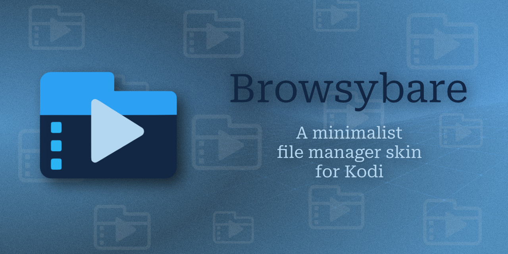
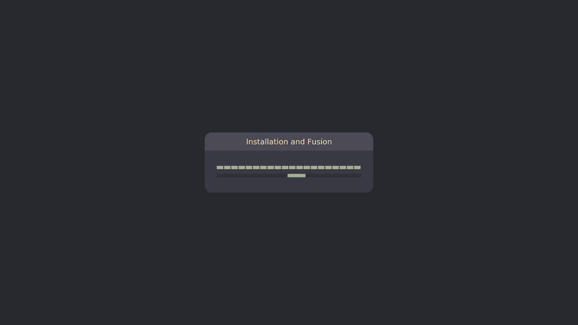

# Browsybare

Minimalist Kodi skin: one interface = file manager. No library, no metadata scraping.

Pick a source, browse folders, play files. Audio plays in a footer overlay, video fullscreen with its own OSD, photos in a dedicated fullscreen viewer. Everything else (Kodi's system settings, the player core, system dialogs) is taken at runtime from the installed Estuary skin as the base layer.

## Screenshots

## File manager

* Single Home window: drive chip, breadcrumb, search, hamburger menu, file list.
* Drive chip with auto width, drive icon, and a no-source state with icon and label.
* Breadcrumb with up to 7 clickable segments. Long names are capped, the middle collapses to an ellipsis when space runs out.
* Own list source (`plugin://browsybare/list`): name, preformatted size, localized date, type icons (folder, video, audio, photo, file), zebra rows, scrolling `..` row below the drive root.
* List-load veil on every drive/folder switch so the previous listing never lingers.
* Search: folder-scoped substring filter with query pill and virtual/hardware keyboard support. Navigation resets the query.
* Sorting: name, size, date, each ascending/descending. Folders-first can be disabled. Hidden files, zebra stripes, and network details are optional.
* Folder sizes: background scan with quick approximation first, then exact values. Network sizes via VFS stat, WebDAV via PROPFIND.
* File operations: rename, copy, cut, paste, delete, new folder, cancel. Clipboard with overwrite and self-move protection. Delete uses a confirm overlay. Rename and new folder use our on-screen keyboard. Percent-encoded paths are decoded at the command edge.
* Hamburger menu: skin name (opens About with OS, Kodi version, resolution, skin version), Shortcuts, Settings, System (base layer), Quit (power menu). Each row carries a matching icon and the panel matches the drive dropdown width.
* Power menu and shutdown timer are generated from the installed Estuary dialog, with safe confirm overlays for destructive actions.
* Own on-screen keyboard for rename, new folder, search, blacklist, and network source fields, with normal, one-shot, and caps-lock case modes. Hardware typing only inserts while the keyboard is open.
* Empty folders show only `..` (subfolder) or an empty list (drive root).

## Audio player

* Footer overlay on the file manager, no window switch. Folder playlist rotated so the selected track starts first.
* Title plus artist, album, and year lines with optional scrolling. Combined elapsed/total time label.
* Seek bar with accent nib plus transport: play/pause, stop, previous, next.
* Rewind/forward with skip accelerator: repeated presses within 2 seconds step 10 s, 30 s, 60 s, 3 min, 10 min.
* State buttons: mute, 3-state repeat (off, all, one), shuffle, speed, info.
* Volume with its own 0-100 curve mapped to the Kodi volume, footer and OSD sliders, external/CEC resync.
* Info button opens the shared INFO modal with extracted tags and covers.
* Continue from the last position: reopening a track that has a saved spot (within the last 7 weeks) opens a Playback prompt with Continue / Restart.
* Bottom padding rows keep the last files above the footer. Focus returns to the list after stop.

## Video player

* Fullscreen playback with a footer OSD in the same layout as audio: title, folder path ticker, combined time, seek bar, transport, state buttons.
* OSD auto-close 7 seconds after it actually appears, extended on input. Playlist advance shows the OSD once.
* Fullscreen without OSD: arrows drive transport (up/next, down/previous, left/rewind, right/forward), OK opens the OSD.
* Optional start-up delay for HDMI resync.
* Subtitle rows sorted alphabetically so Kodi 21 and 22 show the same order. Selection still uses the Kodi stream index.
* Info button opens the shared INFO modal, including MKV/MP4 cover attachments.
* Continue from the last position: reopening a video that has a saved spot (within the last 7 weeks) opens a Playback prompt with Continue / Restart.

## Photo viewer

* Dedicated fullscreen window. Back, ESC, or left-click closes, right-click and Menu are swallowed.
* Loading spinner only for the initial open. Empty-texture open plus crossfade avoids the stale-image flash.
* Folder playlist, optional recursive mode (current folder first, then subfolders in name order, depth and count bounded).
* Formats: JPEG, TIFF, PNG, GIF, BMP natively, AVIF passthrough, HEIC/HEIF only when a real decoder exists (otherwise skipped and inert with a generic icon).
* Pure-Python EXIF orientation with cached rotated copies. Network files via VFS header read and bounded download. Backends: Kodi Pillow, system Python with PIL, ffmpeg.
* Display modes: Standard (fit), Fill (crop), Ken Burns (radial centre-corner-centre zoom with seamless ping-pong loop).
* Memory safe on low-RAM devices: capped textures below ~1.8 GB total RAM, display-sized caps above, reduced JPEG decode peak, single-flight background preload with session stamp, caches and temp files cleared on open and close.
* OSD with previous, play/pause, stop, next, visual-only progress bar, duration cycle (5/10/15/20 s), mode, repeat (loop on/off), shuffle (next only), info.
* Info button opens the shared INFO modal with camera, lens, capture date, exposure, aperture, ISO, focal length, resolution, orientation, file size, and file date (network mtime via VFS).
* Slideshow pauses while the INFO modal is open. Kodi screensaver inhibit while open (optional, seeded from the Kodi screensaver mode).

## INFO modal

* Shared overlay for audio, video, and photo: dim backdrop, 880x680 panel, up to 20 key/value rows, scrollbar, focusable wrapping rows.
* File-direct extraction, no library: MP3 ID3v2, M4A covr, FLAC picture, Ogg picture comment, MKV/WebM attachments. Magic-sniffed, bounded count and size, content-addressed disk cache with daemon prefetch.
* Cold network caches are skipped instead of blocking the modal. Local files are read synchronously.
* Cover strip with up to 3 covers above the rows. Audio and video rows cover title, artist, album, year, genre, duration, codec, bitrate, sample rate, channels, size, date, frame rate, audio tracks, HDR, subtitles, and resolution.
* The background list is disabled while the modal is open.

## Settings

* Own settings dialog with 5 tabs: General, Player, Sources, Blocklist, Remote. It opens over the file manager, which stays visible behind it.
* Appearance and colors: 9 accent swatches with intensity levels, zebra toggle, and a theme switch. A theme recolours every background and text in the skin at once (a light, a medium and a dark palette ship as `LightPearl`, `MediumOvercast` and `DarkNightfall`). Each theme is one JSON file in `themes/`; its file name is the theme name and the numeric sort prefix is not shown. All themes share the same role set with a fixed meaning per role, so a new theme only supplies values. Drop another file in `themes/` to add your own theme. The files carry `//` comments that the loader strips, with each role documented next to its value. Default: `MediumOvercast`.
* Files and folders: hidden files, folder-size scan, network scan, sorting, folders-first.
* System and Kodi: GUI sound volume, screen dimmer.
* Audio player: source path, label scrolling.
* Video player: source path, label scrolling, start-up delay.
* Photo player: source path, label scrolling, include subfolders.
* Some rubric headers have an eraser button with a confirm modal and deterministic defaults.
* Transient overlay properties are cleared on Home load. Ghost overlays cannot survive a reload.

## Sources and blocklist

* Local drives from the mount table with real labels at any depth. Network and directory sources merge in as quasi-drives. On Android the shared storage is the home source and only real removable volumes (SD/USB) appear as drives.
* Hiding is opt-out by identity, so new sticks stay visible. Unplugged directory sources show a hint.
* Entered sources have no `..` at their root. The folder picker turns the main list into a folder-only picker with a bottom bar.
* Network sources: ftp, ftps (read-only), smb, nfs, WebDAV/davs. Editor modal with display name, protocol cycle, server, path, port, user, password, a write-access toggle (off by default; greyed for ftp/ftps), OK, Test, Cancel. Live connection test with state icons. Browser parity plus VFS rename, delete, and new folder (greyed out on read-only sources). Copy, cut, and paste work on writable sources (a server-side move/copy is used when possible) and between local drives and network sources. WebDAV listings retry transient server errors, support Digest authentication, and keep file names with special characters intact.
* Blocklist: read-only seed (Windows system plus macOS dotfiles) plus user list minus off-list, sorted. Inline rows with per-row toggle, add via keyboard, remove via X or row menu, optional match-case. Enforced in listing and folder-size scan.

## Remote, keyboard, shortcut map

* 19 functions: home, menu, settings, back, arrow keys, OK, play/pause (P and Space), stop, rewind, forward, previous, next, volume up/down, mute, power.
* Keymap generated from a template on every Home load, write-on-change only. OBC codes go to universalremote, the rest to keyboard. Per-window sections for Home, VideoOSD, fullscreen video, shutdown menu, settings, and the photo viewer.
* Spare and app buttons are locked to noop by default and can be toggled per row with raw code labels. Adding a key moves it exclusively to one function.
* Space keeps its own dispatcher token so typing stays safe. The on-screen keyboard guard keeps shortcuts out of text input.
* Remote tab: per-function headers, read-only defaults, up to 3 user rows with on/off radios, scanner overlay with live code pill, row menu for toggle and remove.
* Shortcut map in the hamburger menu mirrors the INFO modal (same panel, rows, focus pill, separators, wrap-around, slide-from-bottom). Platform-aware context key (Ctrl+Enter on macOS, Shift+F10 elsewhere).

## Install and update

* Install as addon zip or copy the folder to `addons/<id>/`, then switch the skin to Browsybare.
* First load syncs the Estuary base layer into the install folder when the marker is stale (Kodi/Estuary version plus content hashes). Only the base is copied, own windows, scripts, merged colors, merged languages, merged includes, fonts, power menu, and keymap stay protected or are regenerated.
* Failures show an error dialog and an error label instead of the list. Corrupt addon data is healed by remove and recreate. Downgrade and reinstall show a one-time report modal together with any install errors.
* Built-in update check: the About modal (hamburger menu, skin name) compares the installed version against the latest GitHub release.
* If a newer version exists, the button becomes a download action; a short confirmation prompt then saves the release zip into your Downloads folder (with fallbacks on systems that have none) for manual installation via *Add-ons -> Install from zip file* -- nothing is installed automatically.
* User commands are gated during the sync. Fast quit waits for the daemons with a bounded handshake.

## Requirement

* Kodi 21 ("Omega") or 22 ("Piers")
* The **Estuary skin stays installed** -- Browsybare takes over its windows (settings, player, system dialogs) at runtime as the base layer.
* Languages: English, German, French, Spanish (interface strings plus matching on-screen keyboard layouts). Any other Kodi language falls back to English.

## Development

The repository is the skin source: the folder layout matches the installed addon, so a checkout can be copied to `addons/browsybare/` directly. Kodi picks up XML changes after a skin reload (restart Kodi or briefly switch skins). Log: `~/.kodi/temp/kodi.log` (Linux) / `~/Library/Logs/kodi.log` (macOS), filter: `[skin]`.

## License

MIT (our code). Icon graphics generated from Bootstrap Icons (c) The Bootstrap Authors, MIT. The System menu icon is the official Kodi symbol (c) XBMC Foundation, per the Kodi trademark policy. At runtime, files from the Estuary skin (c) Kodi Team, CC BY-SA 4.0 / GPL-2.0, are used.

## Legal

This skin ships only original files (MIT, our code). It contains no files from Kodi or the Estuary skin: on first load it copies the needed base files from the Estuary skin already installed on your system into its local install folder. No third-party files are distributed.

Kodi and the Kodi logo are trademarks of the XBMC Foundation; this project is not affiliated with or endorsed by them. The bundled logo is used under the Kodi trademark policy. Icon graphics generated from Bootstrap Icons (c) The Bootstrap Authors, MIT.

Use at your own risk, without warranty of any kind.
